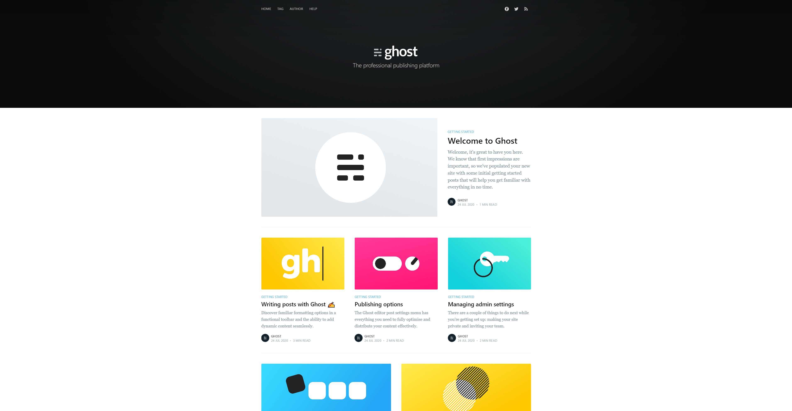

# Ghost showroom



## How to start showroom

In your terminal, please execute the following command :

```bash
make start
```

This will launch Ghost app and his database. Shorty after that, you will be able to access :

- [front office](http://localhost:8080)
- [back office](http://localhost:8080/ghost)

You can create the first admin user by accessing [the admin panel](http://localhost:8080/ghost).

## How to stop showroom

In your terminal, please execute the following command :

```bash
make stop
```

## How to reset showroom

In your terminal, please execute the following command :

```bash
make reset
```
