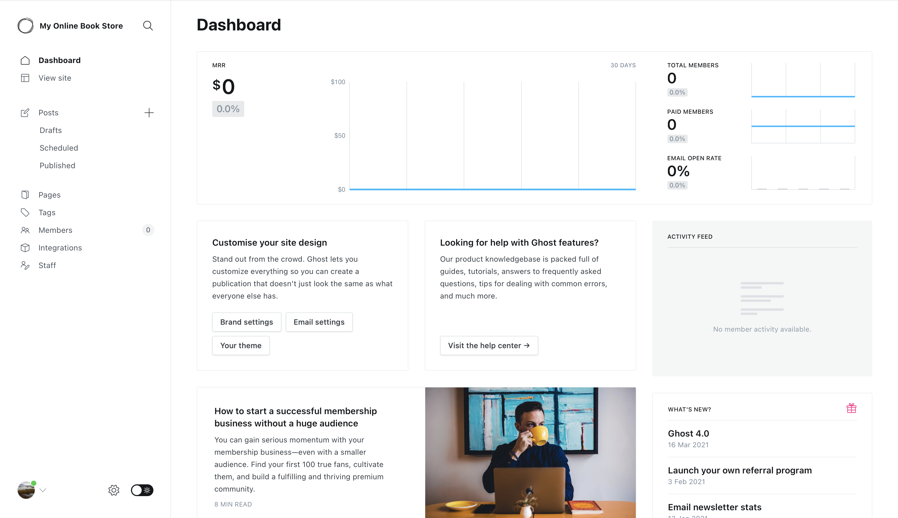

# Ghost showroom

Showroom to sandbox [Ghost](http://ghost.org/), one of the best CMS tool I've ever used.



## Start Ghost

In your terminal, please execute the following command :

```bash
make start
```

This will launch Ghost app and his database. Shorty after that, you will be able to access :

- [front office](http://localhost:80)
- [back office](http://localhost:80/ghost)

You can create the first admin user by accessing [the admin panel](http://localhost:80/ghost).

## Stop showroom

In your terminal, please execute the following command :

```bash
make stop
```

## Reset showroom

In your terminal, please execute the following command :

```bash
make reset
```
